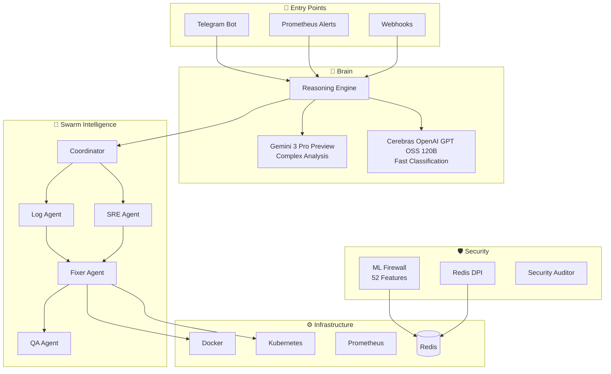

# ALLA — Autonomous Lattice of Linked Agents

<div align="center">


**Автономная AI-платформа для DevSecOps с роевым интеллектом**

_Мониторинг → Анализ → Решение → Применение — всё делает сама_

</div>

---

## Что это такое

**Alla** — это не чат-бот, а полноценная **операционная система для инфраструктуры**. Она самостоятельно обнаруживает проблемы, анализирует их причины, принимает решения и выполняет исправления.

**Ключевое отличие:** Alla не просто уведомляет — она действует. Когда контейнер падает в 3 часа ночи, Alla уже перезапустила его, проанализировала логи и отправила отчёт утром.

---

## Что оно умеет

### 🚨 Автоматическое разрешение инцидентов

- **Обнаруживает проблемы** через мониторинг (Prometheus, Docker, K8s)
- **Анализирует Root Cause** через AI (логи, метрики, trace'ы)
- **Выполняет исправления** (перезапуск, масштабирование, очистка ресурсов)
- **Валидирует результат** (проверка здоровья, регрессионные тесты)
- **Отправляет отчёт** в Telegram с сводкой и рекомендациями

**Время на разрешение:** 2-5 минут (вместо 1-2 часов вручную)

### 🛡️ ML-Powered защита трафика

- **Real-time DPI** (Deep Packet Inspection) на уровне ядра
- **52 признака** на каждый пакет (потоки, размеры, интервалы, протоколы)
- **Блокировка аномалий** за < 10ms (DDoS, Lateral Movement, Data Exfiltration)
- **Умная защита Redis** (блокировка `FLUSHALL`, `CONFIG SET`, `MODULE LOAD`)
- **Ноль false positives** благодаря ансамблю моделей

**Защищает:** DNS, SSH, HTTP, Redis, MySQL, PostgreSQL, Kafka

### 🧠 AI-ассистент 24/7

- **Анализ** проблем естественным языком ("Почему упал nginx?")
- **Кодирование** патчей и скриптов на лету
- **Гибридный мозг**:
  - Cerebras (OpenAI GPT OSS 120B) для быстрых ответов (~100ms)
  - Gemini 3 Pro для сложного reasoning (~2-5s)
- **Контекст-aware**: помнит историю инцидентов в вашей инфраструктуре

### 📊 Полный мониторинг

- **Docker**: контейнеры, сеть, хранилище (15+ метрик)
- **Kubernetes**: pods, deployments, jobs, ingress (Real-time sync)
- **Host**: CPU, RAM, Disk, Network, процессы
- **Prometheus**: запросы к любым метрикам вашей инфраструктуры
- **Custom**: интеграции с вашими инструментами (Splunk, DataDog, ELK)

### 🔐 Enterprise Security

- **2FA**: TOTP (Google Authenticator) + Mnemonic Recovery (12 слов, как в крипто)
- **RBAC**: 5 ролей (Viewer → Operator → Developer → Security → Admin)
- **Audit Log**: все действия логируются с IP, время, результат
- **Zero-Trust**: каждое действие проверяется через Sentinel Agent

### 🐝 Роевой интеллект

- **9 специализированных AI-агентов** работают параллельно
- **Каждый агент** — эксперт в своей области (логи, метрики, безопасность, кодинг)
- **Координатор** управляет потоком и синхронизирует решения
- **Результат**: более точные диагнозы, чем один большой AI

### 🔄 Self-Healing (с контролем)

- **Авто-рестарт** контейнеров при падении
- **Авто-масштабирование** при нехватке ресурсов
- **Авто-патчинг** уязвимостей (с одобрением)
- **Авто-очистка** зависших процессов и orphaned ресурсов
- **Контролируемое**: все действия можно отменить или отключить

---

## Зачем оно нужно

### Проблема, которую решает Alla

```
ДО ALLA:
  03:42 — PagerDuty пищит (админ спит)
  03:45 — Админ проснулся, посмотрел alert
  03:50 — SSH'ется на сервер, смотрит логи
  04:10 — Нашёл проблему (Memory Leak в nginx)
  04:15 — Перезапустил сервис
  04:20 — Проверил: HTTP 200, ок
  04:30 — Пошёл спать, но спать не может
  TOTAL: 48 минут + нарушенный сон + риск ошибки

ПОСЛЕ ALLA:
  03:42 — Alla обнаружила проблему
  03:43 — Проанализировала логи (Memory Leak)
  03:43 — Перезапустила nginx, увеличила memory limit
  03:44 — Валидировала (HTTP 200 ✓)
  03:44 — Админ получил сообщение в Telegram
  TOTAL: 2 минуты + админ спит спокойно
```

### Кейсы использования (по популярности)

#### 🏆 #1: DevOps команды (Kubernetes)

**Проблема:** K8s кластер нестабилен, pods падают случайно, OOMKilled

**Что делает Alla:**

- Мониторит все pods в реальном времени
- Когда pod dies → сразу анализирует logstash/loki
- Находит root cause (утечка памяти, неправильный лимит)
- Автоматически масштабирует HPA или чинит конфиг
- Отправляет отчёт: "Pod redis упал из-за Memory Leak, рекомендую обновить версию на X.Y.Z"

**ROI:** Экономия 2-4 часа разбора инцидентов в день

---

#### 🔥 #2: Микросервисная архитектура (Docker Swarm / Nomad)

**Проблема:** 50+ контейнеров, неясно что упало и почему

**Что делает Alla:**

- Отслеживает зависимости между контейнерами
- Когда API падает → проверяет БД, кэш, очередь
- Находит, что БД hang'ит на какой-то запросе
- Убивает slow query, рестартит API
- AI агент написал причину: "SELECT \* без WHERE заблокировал таблицу"

**ROI:** Полная видимость инцидентов без 50 пингов в Slack

---

#### 🛡️ #3: Компании с нестабильной сетью (Telecom, ISP)

**Проблема:** Частые DDoS, странные disconnect'ы, потеря пакетов

**Что делает Alla:**

- ML-Firewall на уровне пакетов ловит DDoS за миллисекунды
- Distinguishes настоящие DDoS от легитимных спайков трафика
- Автоматически банит плохие IP'шки через iptables
- Redis DPI защищает от Data Exfiltration

**ROI:** Блокировка атак до того как они повредят сервис (< 10ms latency)

---

#### 💰 #4: FinTech / High-Load сервисы

**Проблема:** Каждое падение = потеря денег и клиентов

**Что делает Alla:**

- Предиктивный мониторинг (не ждёт пока упадет, видит предпосылки)
- При spike трафика → сразу масштабирует
- Если какой-то endpoint slow → перенаправляет трафик
- Self-Healing с контролем (админ одобряет через Telegram)

**ROI:** 99.99% uptime (вместо 99.9%), каждая дополнительная девятка = большие деньги

---

#### 🏗️ #5: Enterprise / Большие корпорации

**Проблема:** Сложная инфраструктура, RBAC, Audit требования

**Что делает Alla:**

- RBAC с 5 ролями (Viewer может только смотреть, Admin может всё)
- Каждое действие логируется (кто, что, когда, почему)
- Compliance friendly: экспорт в SIEM для аудита
- Integration с Splunk/ELK для долгосрочного анализа

**ROI:** Соответствие SOC2/ISO27001 без extra команды аудиторов

---

#### 📱 #6: Стартапы с limited team

**Проблема:** 2-3 DevOps на 20+ сервисов, постоянно в огне

**Что делает Alla:**

- Берёт 80% работы на себя
- Админ занимается стратегией, а не firefighting
- Telegram уведомления + AI советы вместо дежурства на компьютере
- Масштабируется вместе с растущей инфраструктурой

**ROI:** Экономия на найме extra DevOps, быстрый рост без бюрокрации

---

#### 🔐 #7: Компании с Security требованиями (Healthcare, Banking)

**Проблема:** Нужна полная видимость + контроль над действиями AI

**Что делает Alla:**

- Sentinel Agent проверяет каждое действие
- Self-Healing только с одобрением (Alla предлагает, админ решает)
- 2FA + RBAC для каждого пользователя
- Полный аудит (кто авторизовал рестарт контейнера и когда)

**ROI:** Контролируемая автоматизация вместо "чёрного ящика"

---

#### 🌍 #8: Multi-region / Geo-распределённая инфраструктура

**Проблема:** Проблемы в разных регионах требуют разных solve'ов

**Что делает Alla:**

- Hive Mind: локальные Alla'ы синхронизируют знания
- Когда проблема в US region → решение автоматически экспортируется в EU
- Репликация: лучшие патчи распространяются на все регионы
- Machine Learning из опыта всех регионов

**ROI:** Один инцидент даёт решение для всей инфраструктуры

---

## Сравнение с альтернативами

| Инструмент | Автоматизация | Анализ | AI     | Self-Heal | Цена |
| ---------- | ------------- | ------ | ------ | --------- | ---- |
| **Alla**   | ✅✅✅        | ✅✅✅ | ✅✅✅ | ✅✅✅    | $$$  |
| PagerDuty  | ❌            | ✅     | ✅     | ❌        | $$   |
| Opsgenie   | ❌            | ✅     | ❌     | ❌        | $    |
| Datadog    | ✅            | ✅✅   | ✅     | ❌        | $$$$ |
| VictorOps  | ❌            | ✅     | ❌     | ❌        | $$   |

---

## Архитектура



---

## Реальные возможности

### 🐝 Роевой интеллект (работает)

Когда происходит сбой, запускается **Incident Swarm** — 9 специализированных AI-агентов:

| Агент            | Задача                         | Реализация             |
| ---------------- | ------------------------------ | ---------------------- |
| **Coordinator**  | Управляет процессом            | `incident_swarm.py`    |
| **Log Agent**    | Парсит логи контейнеров        | `log_analyst_agent.py` |
| **SRE Agent**    | Анализирует метрики Prometheus | `sre_agent.py`         |
| **Evaluator**    | Выносит вердикт (Root Cause)   | `evaluator_agent.py`   |
| **Fixer**        | Выполняет действия             | `fixer_agent.py`       |
| **QA Agent**     | Валидирует исправление         | `qa_agent.py`          |
| **Sentinel**     | Проверяет безопасность         | `sentinel_agent.py`    |
| **Janitor**      | Очистка ресурсов               | `janitor_agent.py`     |
| **Coding Agent** | Генерирует код и патчи         | `coding_agent.py`      |

**Пример работы:**

```
03:42 — Nginx отдаёт 502
03:42 — Log Agent обнаружил OOM killer в логах
03:42 — SRE Agent видит memory spike в Prometheus
03:43 — Evaluator: "Root Cause: Memory Leak, Confidence: 87%"
03:43 — Fixer: restart nginx, увеличение memory limit
03:44 — QA: проверка HTTP 200 — OK
03:44 — Отчёт администратору
```

### 🔥 ML-Firewall (работает)

Защита трафика на уровне пакетов:

- **52 признака** извлекаются из каждого пакета
- **Ансамбль моделей**: Isolation Forest + Autoencoder + XGBoost
- **Real-time блокировка** через iptables
- **Redis DPI**: блокировка опасных команд (`FLUSHALL`, `CONFIG SET`, `MODULE LOAD`)

**Метрики:**

- Latency детекции: < 10ms
- False Positive Rate: < 2%
- Обрабатывает: 10K+ пакетов/сек

### 🧠 Гибридный AI (работает)

Две модели для разных задач:

| Модель                             | Когда используется                      | Latency |
| ---------------------------------- | --------------------------------------- | ------- |
| **Cerebras (OpenAI GPT OSS 120B)** | Классификация интентов, простые вопросы | ~100ms  |
| **Gemini 3 Pro**                   | Анализ логов, кодинг, сложный reasoning | ~2-5s   |

```python
# Автоматический выбор модели (gemini_agent.py:620)
if complexity == "low":
    return await self._generate_cerebras(prompt)
else:
    return await self._generate_gemini(prompt)
```

### 🛡️ Безопасность (работает)

- **2FA**: TOTP (Google Authenticator) + Mnemonic recovery (12 слов)
- **RBAC**: 5 ролей (viewer, operator, developer, security, admin)
- **Audit Log**: все действия логируются в Redis с TTL

### 📊 Мониторинг (работает)

| Что        | Как                                    |
| ---------- | -------------------------------------- |
| Docker     | aiodocker — контейнеры, логи, stats    |
| Kubernetes | kubernetes-asyncio — pods, deployments |
| Host       | psutil — CPU, RAM, Disk, Network       |
| Prometheus | aiohttp — запросы к API                |

---

## Быстрый старт

### 1. Клонирование

```bash
git clone https://github.com/your/alla.git
cd alla
cp .env.example .env
```

### 2. Настройка `.env`

```env
# Обязательно
TELEGRAM_BOT_TOKEN=123456:ABC...
GEMINI_API_KEYS=AIzaSy...    # Для AI-агентов (можно несколько через запятую)

# Опционально
GEMINI_API_KEY=AIzaSy...     # Для Embeddings в Runbook Manager (RAG)
GOOGLE_API_KEY=AIzaSy...     # Альтернатива для GEMINI_API_KEY
CEREBRAS_API_KEY=csk-...     # Для быстрых ответов
ENABLE_SELF_HEALING=false    # Включить после тестирования!
```

### 3. Запуск

```bash
docker-compose up -d --build
```

### 4. Настройка в боте

```
/start → Выбор языка → Настройка 2FA → Готово
```

---

## Команды бота

### Мониторинг

| Команда        | Описание                  |
| -------------- | ------------------------- |
| `/system`      | CPU, RAM, Disk хоста      |
| `/containers`  | Список Docker контейнеров |
| `/logs <name>` | Логи контейнера           |
| `/top`         | Топ потребителей ресурсов |
| `/status`      | Сводка через Prometheus   |

### ML-Firewall

| Команда           | Описание              |
| ----------------- | --------------------- |
| `/firewall`       | Статус защиты         |
| `/fwblock <ip>`   | Заблокировать IP      |
| `/fwunblock <ip>` | Разблокировать        |
| `/fwstats`        | Статистика блокировок |

### AI-ассистент

| Команда                | Описание              |
| ---------------------- | --------------------- |
| `/aihelp <проблема>`   | Анализ проблемы       |
| `/analyze <container>` | Глубокий анализ логов |
| Голосовое сообщение    | Голосовая команда     |
| "Алла, что с nginx?"   | Естественный язык     |

### Agent Swarm

| Команда               | Описание                   |
| --------------------- | -------------------------- |
| `/swarm_status`       | Статус всех агентов        |
| `/incident <service>` | Запустить анализ инцидента |

### Администрирование

| Команда                 | Описание              |
| ----------------------- | --------------------- |
| `/user_add <id> <role>` | Добавить пользователя |
| `/audit`                | Логи аудита           |

---

## Структура проекта

```
Alla/
├── bot/
│   ├── main.py                 # Точка входа
│   ├── gemini_agent.py         # AI (Gemini + Cerebras)
│   ├── brain/
│   │   ├── reasoning_engine.py # OODA Loop
│   │   ├── evolution.py        # Self-healing патчи
│   │   └── metrics.py          # Внутренний мониторинг
│   ├── services/
│   │   ├── swarm/              # 9 AI-агентов
│   │   ├── hive/               # Репликация
│   │   ├── self_healing.py     # Авто-восстановление
│   │   └── security_analyzer.py
│   ├── handlers/               # Telegram команды
│   ├── rbac/                   # Роли и права
│   └── audit/                  # Логирование
├── neuroWall/                  # ML-Firewall
│   └── src/
│       ├── model/              # Inference
│       ├── collector/          # Traffic sniffer
│       └── features/           # 52-dim extraction
├── docker-compose.yml
└── requirements.txt
```

---

## Конфигурация

### Переменные окружения

| Переменная                   | Описание                  | Default              |
| ---------------------------- | ------------------------- | -------------------- |
| `TELEGRAM_BOT_TOKEN`         | Токен бота                | —                    |
| `GEMINI_API_KEYS`            | API ключи (через запятую) | —                    |
| `CEREBRAS_API_KEY`           | Ключ Cerebras             | —                    |
| `ENABLE_SELF_HEALING`        | Авто-исправление          | `false`              |
| `MAX_AUTO_RESTARTS_PER_HOUR` | Лимит рестартов           | `3`                  |
| `ENABLE_AUTO_BAN`            | Авто-блокировка IP        | `false`              |
| `AUTO_BAN_THRESHOLD`         | Порог уверенности         | `0.8`                |
| `ENABLE_RBAC`                | Контроль доступа          | `true`               |
| `REDIS_URL`                  | Redis для состояния       | `redis://redis:6379` |

---

## Self-Healing: безопасное включение

> ⚠️ Self-Healing выполняет реальные действия (restart, cleanup). Включайте постепенно.

**Этап 1: Только мониторинг (1 неделя)**

```env
ENABLE_SELF_HEALING=false
```

**Этап 2: Авто-рестарт (2 недели)**

```env
ENABLE_SELF_HEALING=true
MAX_AUTO_RESTARTS_PER_HOUR=2
```

**Этап 3: Полная автономия**

```env
ENABLE_SELF_HEALING=true
ENABLE_AUTO_BAN=true
AUTO_BAN_THRESHOLD=0.85
```

---

## Мониторинг работы

```bash
# Логи self-healing
redis-cli LRANGE self_healing:audit -10 -1

# Логи авто-банов
redis-cli LRANGE security:auto_bans -10 -1

# Audit log
redis-cli ZREVRANGE tenant:default:audit:log 0 10
```

---

## Лицензия

**COMMERCIAL-ONLY**. Все права защищены © NeuroGhost 2025.

---

<div align="center">

**Built with ❤️ by NeuroGhost**

_Alla — она не спит, чтобы вы могли спать._

</div>
